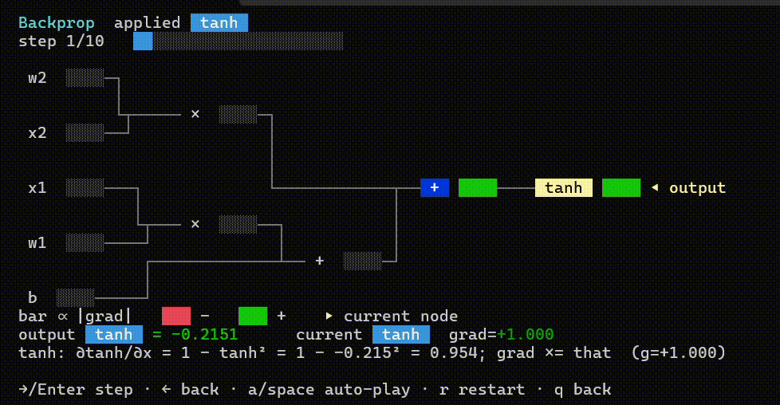

# micrograd4j

[](https://github.com/anand-krishanu/micrograd4j/actions/workflows/ci.yml)
[](https://jitpack.io/#anand-krishanu/micrograd4j)
[](LICENSE)
[](#build--test)

**micrograd, but you can _watch_ backpropagation happen — in your terminal, in plain Java.**

A tiny scalar-valued **autograd engine** (~230 lines) and a small **neural-network library** on top
of it. A faithful port of [Andrej Karpathy's micrograd](https://github.com/karpathy/micrograd):
small enough to read in one sitting, correct enough to train a real classifier — paired with an
interactive playground that lets you step through the chain rule one node at a time.

<p align="center">
  
  <br>
  <em>The <code>:step</code> scrubber — watch gradients flow back through the graph, one node at a time.</em>
</p>

```java
Value a = new Value(2.0);
Value b = new Value(-3.0);
Value L = a.multiply(b).add(10.0).multiply(-2.0);
L.backward();
System.out.println(a.grad);  // 6.0  ->  dL/da
```

> **Who it's for:** Java developers curious about how deep-learning frameworks actually work under the
> hood — learning reverse-mode autodiff by *reading and poking at* the code instead of staring at math.

## Try it in 10 seconds (no install)

With [JBang](https://www.jbang.dev) (`curl -Ls https://sh.jbang.dev | bash`, or `choco install jbang`):

```bash
# Zero-install autograd demo — no clone, no build:
jbang https://raw.githubusercontent.com/anand-krishanu/micrograd4j/main/examples/Quickstart.java
```

JBang pulls the library from JitPack and runs the file for you.

## The interactive playground

```bash
jbang https://raw.githubusercontent.com/anand-krishanu/micrograd4j/main/examples/Playground.java
```

A keyboard-driven terminal UI (arrow keys + Enter, `q` to go back). Five things you can do:

| Mode | What you get |
|------|--------------|
| **Autograd playground** | Type expressions (`(a*b) + c.tanh()`), see the value plus every input's gradient. `:graph` draws the colour-coded computation graph with gradient **heat-bars**; `:step` animates backprop; `:explain` prints the chain rule each op applies. |
| **Train a network** | Pick a dataset (`moons` / `xor` / `circles` / your own) and watch a live **braille loss curve**, accuracy sparkline, and a 256-colour **decision-boundary heatmap**. |
| **Step through backprop** | The scrubber: step the backward pass forward/back, or auto-play, and read the local rule at each node as gradients light up. |
| **Learn how autograd works** | A one-minute guided tour of the forward graph and the chain rule. |
| **Settings** | Tune dataset, hidden layers, activation, epochs, learning rate, seed (or apply a preset). |

> Every visual degrades gracefully: piped input or `--demo` falls back to plain ASCII with no colour
> or cursor tricks, so it stays readable in a log. Smoke run: `jbang examples/Playground.java --demo`.

## How autograd works (30 seconds)

Every `Value` remembers the operation that created it and its parents, so a chain of arithmetic forms
a graph. `backward()` walks that graph in **reverse topological order** and, at each node, applies the
**chain rule** — multiplying the gradient arriving from above by that op's *local* derivative — and
accumulates it into each input's `.grad`. That single idea, node by node, is the engine behind every
deep-learning framework — here it's ~230 readable lines.

Full worked walkthrough: **[docs/HOW_AUTOGRAD_WORKS.md](docs/HOW_AUTOGRAD_WORKS.md)**

## Use it as a dependency

<details open>
<summary><b>Maven</b> (via JitPack)</summary>

```xml
<repositories>
  <repository>
    <id>jitpack.io</id>
    <url>https://jitpack.io</url>
  </repository>
</repositories>

<dependency>
  <groupId>com.github.anand-krishanu</groupId>
  <artifactId>micrograd4j</artifactId>
  <version>v1.2.1</version>
</dependency>
```

</details>

<details>
<summary><b>Gradle</b> (Kotlin DSL)</summary>

```kotlin
repositories { maven("https://jitpack.io") }
dependencies { implementation("com.github.anand-krishanu:micrograd4j:v1.2.1") }
```

</details>

> Replace `v1.2.1` with any released tag, `main-SNAPSHOT`, or a commit hash. (The JitPack coordinate is
> `com.github.anand-krishanu`; the Java package is `io.github.anandkrishanu`.)

## What's inside

| Class        | Role                                                                 |
|--------------|----------------------------------------------------------------------|
| `Value`      | A scalar that records how it was computed; supports `backward()`     |
| `Activation` | `LINEAR`, `RELU`, `TANH`                                             |
| `Neuron`     | `w · x + b` followed by an activation                                |
| `Layer`      | A row of neurons over the same input                                 |
| `MLP`        | A stack of layers (hidden activation configurable, linear output)    |

### Autograd

```java
Value x = new Value(-4.0);
Value y = x.power(2).add(x.multiply(3)).add(1);  // y = x^2 + 3x + 1
y.backward();
System.out.println(y.data);  // 5.0
System.out.println(x.grad);  // 2x + 3 = -5.0
```

Supported ops: `add`, `subtract`, `multiply`, `divide`, `power`, `negate`, `relu`, `tanh`, `exp`
(each with `double` overloads where it makes sense).

### Training a network

```java
MLP model = new MLP(2, new int[]{16, 16, 1}, Activation.TANH);

for (int step = 0; step < 100; step++) {
    Value loss = computeLoss(model, xs, ys);  // your loss as a Value graph
    model.zeroGrad();
    loss.backward();
    for (Value p : model.parameters()) {
        p.data -= 0.05 * p.grad;               // SGD step
    }
}
```

## Build & test

Ships a Maven Wrapper, so you only need a JDK (17+):

```bash
./mvnw test          # Linux / macOS  (mvnw.cmd on Windows)

# Run the bundled demos:
./mvnw -q exec:java -Dexec.mainClass=io.github.anandkrishanu.micrograd.examples.GradCheck   # PyTorch-verified gradients
./mvnw -q exec:java -Dexec.mainClass=io.github.anandkrishanu.micrograd.examples.MoonsDemo   # two-moons, reaches 100% acc
```

## Contributing

Contributions are welcome, and this is a friendly place for a first OSS PR — **adding a new op (e.g.
`sigmoid`, `log`) is the ideal one.** See [CONTRIBUTING.md](CONTRIBUTING.md) for the 3-step recipe.
By participating you agree to the [Code of Conduct](CODE_OF_CONDUCT.md).

## Credits

A Java port of [karpathy/micrograd](https://github.com/karpathy/micrograd) by Andrej Karpathy.
Licensed under the [MIT License](LICENSE).
